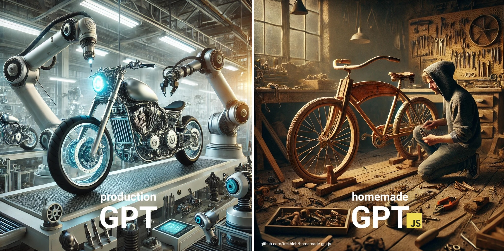
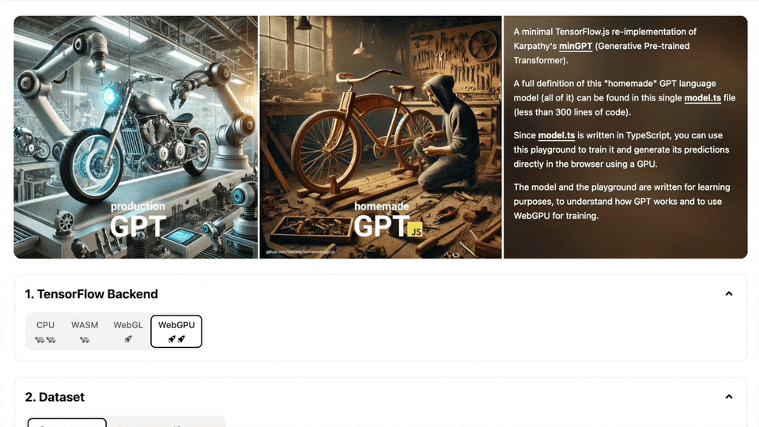

# Homemade GPT • JS



A minimal TensorFlow.js re-implementation of Karpathy's [minGPT](https://github.com/karpathy/minGPT) (Generative Pre-trained Transformer).

A full definition of this "homemade" **GPT** language model (all of it) can be found in this single [model.ts](./gpt/src/model.ts) file (less than `300` lines of code).

Since [model.ts](./gpt/src/model.ts) is written in TypeScript, you can use [homemade GPT playground](https://trekhleb.dev/homemade-gpt-js) to train it, experiment with parameters, and generate its predictions directly in the browser using a GPU.

The model and the playground are written for *learning purposes*, to understand how GPT works and to use WebGPU for training.

To understand what's happening in the [model.ts](./gpt/src/model.ts) file please refer to Andrej Karpathy's well-explained, hands-on lecture "[Let's build GPT: from scratch, in code, spelled out](https://www.youtube.com/watch?v=kCc8FmEb1nY)" (arguably one of the best explanations of GPT out there).

### GPT Folder

Inside the [./gpt/src/](./gpt/src/) folder you'll find the following files:

- [model.ts](./gpt/src/model.ts) - this is the main file of interest, as it contains the full (yet minimalistic) definition of the decoder GPT model, as described in the [Attention Is All You Need](https://arxiv.org/pdf/1706.03762) paper.
- [model-easier.ts](./gpt/src/model-easier.ts) - this is the same GPT model as in the previous file but simplified for easier understanding. The main difference is that it processes all `Heads` inside `CausalSelfAttention` *sequentially* (instead of in parallel). As a result, the model is a bit slower but more readable.
- [config.ts](./gpt/src/config.ts) - contains pre-configured sets of GPT model parameters: GPT-pico, GPT-nano, GPT-mini, GPT-2, etc.
- [dataset.ts](./gpt/src/dataset.ts) - Nothing GPT-specific here. A helper wrapper on top of any txt-file-based character-level dataset. It loads an arbitrary txt file, treats each letter as a token, splits the characters into training and testing batches, and encodes/decodes letters to indices and vice versa.
- [trainer.ts](./gpt/src/trainer.ts) - Nothing GPT-specific here as well. This file provides a simple training loop that could apply to any arbitrary neural network.

### Web Playground

To experiment with model parameters, training, and text generation you may use the [homemade GPT playground](https://trekhleb.dev/homemade-gpt-js).

|http://trekhleb.dev/homemade-gpt-js|
|---|
||

You may also launch the playground locally if you want to modify and experiment with the code of the transformer model itself.

Install dependencies: 

```sh
npm i
```

Launch web playground locally:

```sh
npm run playground-web
```

The playground will be accessible on http://localhost:3000/homemade-gpt-js 

Run these commands from the root of the project. You need to have Node.js ≥ 20.0.0.

### Node.js Playground

Node.js >20.0.0 is required

```sh
npm i
```

@todo add GPT image with highlighted decoder
